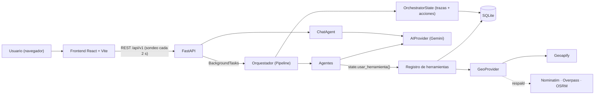
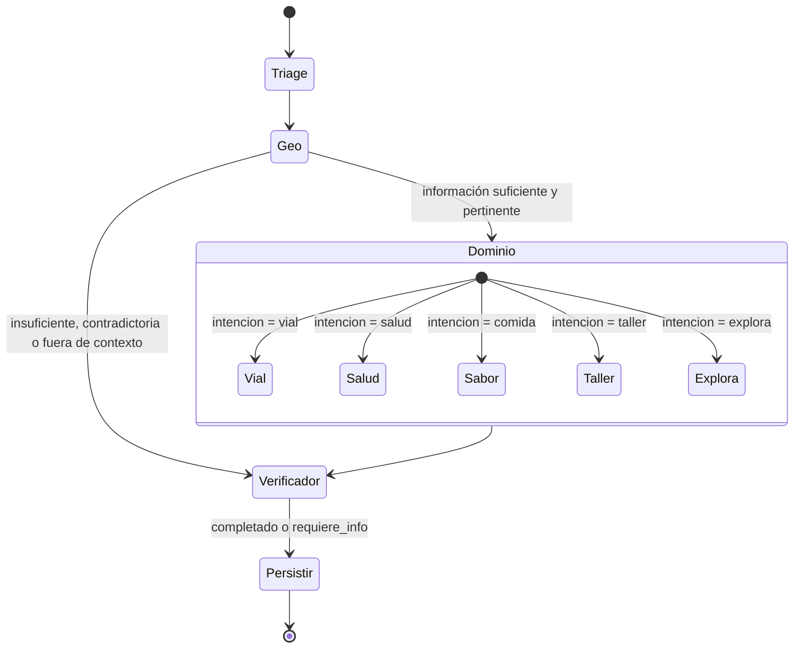
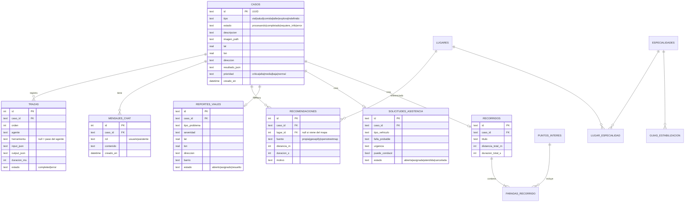
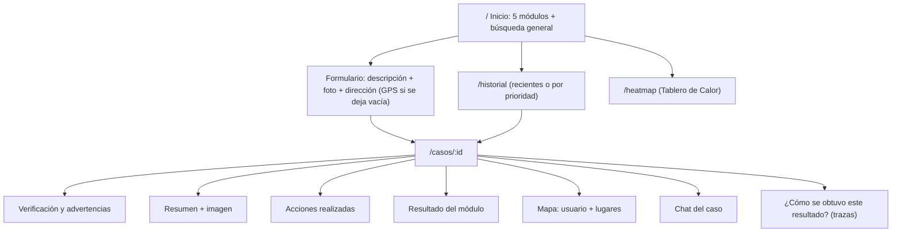

# Plan técnico — ORBIS · Asistente Urbano Inteligente

> Proyecto final Unidad III: *Solución inteligente multimodal con herramientas, geolocalización y agentes*
> Base de partida: `ia-integrada-incidentes` (FastAPI + Gemini + React/Vite) del curso
> Sustentación: **17 de octubre de 2026**
> Integrantes: Juan Pablo Guillen, Cristian Orlando Avila, Andrés Felipe Bohórquez Bernal

> [!NOTE]
> **Este documento describe lo que está implementado** en el repositorio. Lo que se planeó al inicio y se cambió o quedó fuera de alcance está en la sección 12, con la razón de cada decisión. Instalación y uso: ver `README.md`.

---

## 1. Alcance y usuarios

**Ciudad:** Bogotá (datos propios de ejemplo y línea de emergencias **123**).
**Usuarios:** ciudadanos (peatones, conductores, turistas) que necesitan orientación rápida; y un rol de consulta (docente/evaluador) que revisa historial, mapa y trazabilidad.

| Módulo | Necesidad del usuario | Resultado del sistema | Acción ejecutada (Fase 4) |
|---|---|---|---|
| **Vía** · Problemas viales | "Hay un hueco enorme aquí" + foto + ubicación | Tipo de daño, severidad, riesgo, entidad responsable, reportes duplicados a < 150 m | **Crea un reporte vial** (visible en el Tablero de Calor) |
| **Salud** · Orientación | "Me duele mucho el pecho y el brazo izquierdo" | Urgencia, especialidad, señales de alarma, qué hacer / qué no hacer, centros cercanos con ruta real | **Guarda la recomendación** del centro con menor tiempo de llegada |
| **Sabor** · Comida | "Antojo de hamburguesa, máximo 40 mil" | Lugares a ≤ 2 km con motivo, precio (solo si está verificado) y ruta a pie | **Guarda la recomendación** principal |
| **Taller** · Asistencia vehicular | "Mi carro echa humo" + foto del tablero | Falla probable, urgencia, ¿puede conducir?, pasos de seguridad, talleres cercanos con ruta | **Crea una solicitud de asistencia** (estado `abierta`) |
| **Explora** · Turismo | Foto de un lugar + "tengo 3 horas, me gustan los museos" | Lugar reconocido (buscado por nombre en el mapa si no está en los datos propios), recorrido ordenado con tiempos y rutas | **Guarda el recorrido** (paradas, distancia y duración total) |

> [!WARNING]
> **Salud no diagnostica.** Reglas deterministas (no el LLM) detectan señales de alarma y fuerzan urgencia *emergencia* + 123. Las recomendaciones de estabilización salen de la tabla de guías de la BD.
> **Taller:** reglas fijas (humo, fuego, frenos, olor a gasolina) obligan a `puede_conducir = false` y urgencia alta.
> **Explora:** si el lugar reconocido no se puede ubicar con el servicio de mapas, no se muestra ninguna dirección.

---

## 2. Cumplimiento de la rúbrica

| Fase | Cómo se cumple |
|---|---|
| 1. Arquitectura | Secciones 3–6 de este documento y sección 2 del README (corresponden al código) |
| 2. Multimodal + estructurado | Texto + imagen + GPS o dirección. Gemini recibe la imagen y responde JSON validado con esquemas Pydantic por dominio. `calidad_informacion` detecta datos insuficientes, contradicciones (p. ej. la foto no coincide con el texto) o solicitudes fuera de contexto → estado `requiere_info`, sin ejecutar acciones |
| 3. Datos propios + geo | SQLite con lugares, especialidades, guías, puntos de interés y reportes. **Geoapify** (geocodificación, inversa, lugares, rutas) con respaldo **OpenStreetMap** (Nominatim, Overpass, OSRM de FOSSGIS) |
| 4. Herramientas y acciones | 16 herramientas en un registro central; 4 acciones reales que escriben en la BD |
| 5. Chat contextual | Chat por caso con el resultado + salidas reales de las herramientas; dice explícitamente cuando no tiene un dato verificado |
| 6. Agentes y orquestación | 9 agentes con responsabilidades separadas + orquestador determinista (`Pipeline`) |
| 7. Persistencia y trazabilidad | Tablas `casos`, `trazas`, `mensajes_chat` y de acciones. Vista "¿Cómo se obtuvo este resultado?" e Historial |

---

## 3. Stack implementado

| Capa | Tecnología | Justificación |
|---|---|---|
| Backend | **Python 3.11+ · FastAPI** (async) + Uvicorn | Continuidad con el proyecto base; async para la E/S de IA y mapas |
| Validación / config | Pydantic v2 + `pydantic-settings` (`.env`) | Esquemas de respuesta estructurada y configuración por entorno |
| BD | **SQLAlchemy 2.0 async + aiosqlite + SQLite** (WAL, `foreign_keys=ON`) | Sin servidor de BD; migrable a PostgreSQL cambiando `DATABASE_URL` |
| IA | **Google GenAI SDK** · `gemini-3.1-flash-lite` (configurable con `GEMINI_MODEL`) | Multimodal, salida JSON con esquema, baja latencia, cuota gratuita |
| Mapas | **Geoapify** · respaldo **Nominatim / Overpass / OSRM (FOSSGIS)** | 3.000 créditos/día gratis sin tarjeta; el respaldo permite funcionar sin clave |
| HTTP | `httpx.AsyncClient` + `tenacity` (reintentos con backoff) | Resiliencia ante caídas o saturación de APIs externas |
| Imagen | Pillow (orientación EXIF, reducción a 1600 px, JPEG) | Fotos de celular de varios MB → pocos cientos de KB antes de enviarlas al modelo |
| Logs | `structlog` (consola en desarrollo, JSON con `ENVIRONMENT=prod`) | Observabilidad técnica, separada de la trazabilidad funcional |
| Frontend | **React 19 + TypeScript + Vite + React Router + TanStack Query** | SPA con caché y sondeo del estado del caso |
| Estilos | CSS con tokens (custom properties) + estilos en línea | Sistema de diseño propio (sección 11) |
| Mapa | **Leaflet / react-leaflet** + teselas OpenStreetMap | Ligero y gratuito |

---

## 4. Arquitectura

### 4.1 Vista general



### 4.2 Organización del backend (`backend/app/`)

```
api/v1/casos.py      → endpoints (casos, imagen, trazas, chat)
orchestrator/        → pipeline.py (orden y condiciones) · state.py (contexto, trazas, acciones, usar_herramienta)
agents/              → triage, geo, via, salud, sabor, taller, explora, verificador, chat · comun.py (utilidades)
tools/               → registry.py · local.py (datos propios y reglas) · geo.py (mapas) · actions.py (acciones)
providers/           → ai.py (Gemini) · geo.py (Geoapify / OpenStreetMap)
models/ schemas/     → SQLAlchemy (tablas) · Pydantic (respuestas estructuradas)
seed/                → datos propios de Bogotá (se cargan solos al iniciar)
```

### 4.3 Patrones de diseño aplicados

| Patrón | Dónde | Beneficio |
|---|---|---|
| **Pipeline** | `orchestrator/pipeline.py` | Orden y condiciones explícitas, auditables, sin depender de un prompt |
| **Strategy** | Agentes de dominio, elegidos por `intencion` | Agregar un dominio sin cambiar el orquestador |
| **Registry** | `tools/registry.py` | Todas las herramientas se invocan por nombre y quedan trazadas |
| **Adapter + fallback** | `GeoProvider` (Geoapify ↔ OpenStreetMap) | Cambiar de proveedor sin tocar los agentes |
| **Facade** | `AIProvider` sobre Gemini | Un único punto para modelo, esquemas, imagen y reintentos |
| **Retry con backoff** | `tenacity` en IA y mapas | Tolerancia a errores 503 / timeouts |
| **Chain of Responsibility** | Reglas de alarma (Salud) y riesgo (Taller) antes y después del LLM | Las reglas de seguridad tienen prioridad absoluta |
| **Template Method** | `BaseAgent.run()` → `_process()` | Todos los agentes registran su traza igual |

---

## 5. Agentes y orquestación (Fase 6)

| Agente | Responsabilidad | Recibe | Herramientas | Produce |
|---|---|---|---|---|
| **TriageAgent** | Clasificar intención y validar la calidad de la entrada | Texto, imagen, si hay GPS/dirección | Gemini (multimodal) | `intencion`, `confianza`, resumen, `observacion_imagen`, entidades, `calidad_informacion` |
| **GeoAgent** | Resolver dónde está el usuario y alertas de la zona | GPS o dirección escrita | `geocodificar_direccion`, `identificar_direccion`, `consultar_reportes_cercanos` | `UbicacionResuelta` (+ marca si es aproximada) y alertas comunitarias |
| **VialAgent** | Diagnosticar el daño y registrar el reporte | Texto, imagen, ubicación | `consultar_reportes_cercanos`, **`crear_reporte_vial`** | Tipo, severidad, riesgo, entidad, duplicados, `reporte_id` |
| **SaludAgent** | Orientar urgencia, especialidad y estabilización | Síntomas, imagen, ubicación | `evaluar_senales_alarma`, `consultar_lugares_propios`, `consultar_guias_estabilizacion`, `buscar_lugares_externos`, `calcular_ruta`, **`guardar_recomendacion`** | Urgencia, especialidad, pasos, centros con ruta real |
| **SaborAgent** | Recomendar dónde comer | Antojo, presupuesto, ubicación | `consultar_lugares_propios`, `buscar_lugares_externos`, `calcular_ruta`, **`guardar_recomendacion`** | Lugares con motivo, precio verificado o no, ruta a pie |
| **TallerAgent** | Orientar sobre la falla y abrir la asistencia | Falla, foto, ubicación | `evaluar_riesgo_vehicular`, `consultar_lugares_propios`, `buscar_lugares_externos`, `calcular_ruta`, **`crear_solicitud_asistencia`** | Falla, urgencia, `puede_conducir`, pasos, talleres, `solicitud_id` |
| **ExploraAgent** | Reconocer el lugar y diseñar el recorrido | Foto, intereses, tiempo, ubicación | `consultar_puntos_interes`, `buscar_lugar_por_nombre`, `calcular_ruta`, **`guardar_recorrido`** | Lugar, paradas ordenadas con rutas (a pie o en carro si el tramo > 2,5 km), `recorrido_id` |
| **VerificadorAgent** | Control de calidad **sin LLM** y respuesta final | Salidas de todos los agentes + trazas | — | `RespuestaFinal` con `verificacion` (aprobado, advertencias, descartados, fuentes) y **`prioridad`** |
| **ChatAgent** | Preguntas de seguimiento | Resultado + salidas de herramientas + historial | Gemini | Respuesta en texto citando la fuente |

### Flujo del orquestador



- El orquestador es **código**, no un prompt. Geo se ejecuta siempre para que el caso quede geolocalizado.
- **Separación real de responsabilidades:** el modelo clasifica, interpreta y redacta; las reglas deciden la seguridad; el servicio de mapas calcula distancias y tiempos; el Verificador descarta lugares que no estén en los datos consultados.
- **Priorización (Verificador):** `emergencia` o `critica` → **crítica**; Taller con urgencia alta y sin poder conducir → **crítica**; `alta` → alta; `media` → media; `baja` → baja; Sabor y Explora → baja; casos sin resultado de dominio → normal. El Historial puede ordenarse por prioridad.

---

## 6. Herramientas (Fase 4)

Todas se registran en `tools/registry.py`. Los agentes las invocan con `state.usar_herramienta(agente, herramienta, **args)`, que guarda en la traza el agente, la entrada, la salida, la duración y si falló.

| Herramienta | Tipo | Fuente |
|---|---|---|
| `consultar_lugares_propios(categoria, lat, lon, radio_m)` | Datos propios | SQLite |
| `consultar_especialidades(sintomas)` / `consultar_guias_estabilizacion()` | Datos propios | SQLite |
| `consultar_puntos_interes(lat, lon, radio_m)` | Datos propios | SQLite |
| `consultar_reportes_cercanos(lat, lon, radio_m)` | Datos propios | SQLite |
| `evaluar_senales_alarma(sintomas)` / `evaluar_riesgo_vehicular(falla)` | Reglas | Código |
| `geocodificar_direccion(direccion)` | Mapas | Geoapify → Nominatim |
| `identificar_direccion(lat, lon)` | Mapas | Geoapify → Nominatim |
| `buscar_lugares_externos(categoria, lat, lon, radio_m)` | Mapas | Geoapify Places → Overpass |
| `buscar_lugar_por_nombre(nombre, lat, lon)` | Mapas | Geoapify → Nominatim (solo resultados concretos, confianza ≥ 0,7) |
| `calcular_ruta(origen, destino, modo)` | Mapas | Geoapify Routing → OSRM (FOSSGIS) |
| **`crear_reporte_vial(...)`** | **Acción** | SQLite |
| **`crear_solicitud_asistencia(...)`** | **Acción** | SQLite |
| **`guardar_recorrido(...)`** | **Acción** | SQLite |
| **`guardar_recomendacion(...)`** | **Acción** | SQLite |

---

## 7. Datos (SQLite)



- Otras tablas: `lugares`, `puntos_interes`, `paradas_recorrido`, `especialidades`, `lugar_especialidad`, `guias_estabilizacion`.
- **Seed (`seed/datos_iniciales.py`)**, se carga solo al iniciar si la BD está vacía: 10 especialidades, 8 lugares (hospitales, clínicas, restaurantes, talleres), 4 puntos de interés del centro y 2 guías de estabilización. Es un conjunto de **demostración**; por eso Salud, Sabor y Taller completan con lugares reales del servicio de mapas.
- Precios: solo los datos propios muestran precio verificado; los lugares del mapa se muestran sin precio.
- `seed_casos.py` (opcional) inserta 100 reportes simulados para el Tablero de Calor.

---

## 8. API (`/api/v1`)

| Método | Ruta | Descripción |
|---|---|---|
| GET | `/health` | Estado del servicio |
| POST | `/casos` | Multipart: `descripcion`, `imagen?`, `lat?`, `lon?`, `direccion?`, `tipo?` → `202 {id, estado}` |
| GET | `/casos?orden=recientes\|prioridad` | Historial (100 más recientes, o los más urgentes primero) |
| GET | `/casos/viales` | Casos geolocalizados para el Tablero de Calor |
| GET | `/casos/{id}` | Caso + resultado estructurado + acciones + prioridad |
| GET | `/casos/{id}/imagen` | Imagen enviada por el usuario |
| GET | `/casos/{id}/trazas` | Trazabilidad completa (agentes y herramientas, entrada/salida) |
| GET / POST | `/casos/{id}/chat` | Historial del chat / nueva pregunta |

Errores con códigos HTTP reales: `400` imagen inválida, `404` caso inexistente, `409` chat antes de terminar el análisis, `413` imagen > 10 MB, `422` validación.

### Respuesta estructurada (`RespuestaFinal`)

```json
{
  "caso_id": "…",
  "intencion": "salud",
  "confianza": 1.0,
  "resumen": "…",
  "observacion_imagen": null,
  "ubicacion": { "texto": "Calle 62 11-04, Chapinero…", "lat": 4.6486, "lon": -74.0628, "barrio": "…", "fuente": "gps" },
  "calidad_informacion": { "suficiente": true, "contradicciones": [], "datos_faltantes": [], "fuera_de_contexto": false },
  "salud": {
    "nivel_urgencia": "emergencia",
    "especialidad_sugerida": "Cardiología / Urgencias",
    "senales_alarma": ["Posible infarto"],
    "recomendaciones_estabilizacion": ["Llama a la línea de emergencias 123.", "…"],
    "que_no_hacer": ["…"],
    "centros": [{ "nombre": "Hospital Universitario San Ignacio", "distancia_m": 3822, "duracion_s": 415,
                  "lat": 4.6288, "lon": -74.0645, "ruta_verificada": true, "telefono": "…", "fuente": "propia" }],
    "aviso": "…"
  },
  "acciones": [{ "tipo": "recomendacion_guardada", "id": 1, "lugar": "Hospital Universitario San Ignacio" }],
  "verificacion": { "aprobado": true, "advertencias": [], "lugares_descartados": [], "fuentes": ["calcular_ruta", "…"] },
  "prioridad": "critica"
}
```

Bloques equivalentes: `vial`, `sabor`, `taller`, `explora` (ver `schemas/domain.py`).

---

## 9. Pantallas implementadas



Mientras el caso se procesa, la vista consulta el estado cada 2 s y muestra "Los agentes están analizando el caso…".

---

## 10. Viajes de usuario (guion de la demo)

| Etapa | Salud (Laura) | Vía (Andrés) | Explora (Sofía) |
|---|---|---|---|
| Entrada | "Dolor fuerte en el pecho y el brazo izquierdo" + GPS | Foto del hueco + "hueco grande en el carril derecho" + GPS | Foto de un lugar + "quiero conocer este lugar" |
| Resultado | Urgencia EMERGENCIA (regla), 123, 3 centros con ruta real | Severidad, entidad responsable, duplicados cercanos | Lugar reconocido y ubicado en el mapa, recorrido con rutas |
| Acción | Recomendación guardada · prioridad **crítica** | Reporte vial creado · visible en el Tablero de Calor | Recorrido guardado |
| Seguimiento (chat) | "¿Cuál me queda más rápido?" | "¿Ya hay otros reportes aquí?" | "¿Dónde queda?" |
| Caso negativo | — | Texto de hueco + foto que no corresponde → contradicción, `requiere_info`, sin acción | Lugar no ubicable → advertencia, sin dirección inventada |

---

## 11. Sistema de diseño (implementado en `frontend/src/styles/`)

**Concepto:** *"Lujo urbano nocturno"*: negro tinta, oro champán y jade; serif editorial con sans técnica.

| Token | Valor (oscuro) | Uso |
|---|---|---|
| `--bg` / `--surface-1` / `--surface-2` | `#0B0D12` / `#12151C` / `#1A1E27` | Fondo y tarjetas |
| `--border` | `#2A2F3A` | Bordes |
| `--text` / `--text-muted` | `#F5F3EE` / `#A8A49C` | Texto |
| `--primary` (oro champán) / `--on-primary` | `#C9A45C` / `#0B0D12` | CTA, títulos, marca |
| `--secondary` (jade) | `#4FC1A0` | Acciones realizadas, herramientas en la traza |
| `--accent-via` · `salud` · `sabor` · `taller` · `explora` | `#E8A23A` · `#F07167` · `#D98E5F` · `#7FA7C9` · `#B79CED` | Color de cada módulo |
| `--success` · `--warning` · `--danger` · `--info` | `#3CCB8A` · `#F2B640` · `#FF5D5D` · `#6EA8FE` | Estados y prioridad |

- **Tipografía:** *Fraunces* (títulos), *Inter* (interfaz), *JetBrains Mono* (datos de la traza). Escala de 9 pasos (`--fs-2xs` … `--fs-4xl`).
- **Movimiento:** tokens de duración y curvas, y animaciones `fade-in`, `slide-up`, `scale-up`, `pulse` y `.animate-spin` en `motion.css`. Con `prefers-reduced-motion` se desactivan.
- `tokens.css` incluye también los valores del tema claro (`[data-theme='light']`), aún sin selector en la interfaz.
- **Accesibilidad aplicada:** `lang="es-CO"`, textos alternativos en imágenes, `aria-label` en controles sin texto, `aria-expanded` en la traza y `aria-pressed` en el orden del historial. La urgencia y la prioridad se muestran con texto, no solo con color.

---

## 12. Cambios respecto al plan inicial

| Planeado | Implementado | Razón |
|---|---|---|
| Progreso en vivo por **SSE** (`/casos/{id}/eventos`) | Sondeo cada 2 s + traza completa al terminar | Menos complejidad; el análisis dura entre 5 y 30 s y la traza muestra el detalle de cada paso |
| `gemini-2.5-flash` + `flash-lite` | `gemini-3.1-flash-lite`, configurable | `gemini-2.5-flash` no estaba disponible para la cuenta (404) |
| Tabla `acciones` | Las acciones viven en sus tablas (`reportes_viales`, `solicitudes_asistencia`, `recorridos`, `recomendaciones`), en `resultado_json.acciones` y en la traza | Evita duplicar información |
| Capas `repositories/` y `services/` | Las herramientas acceden a la BD con sesiones async | Proyecto pequeño; las carpetas existen para crecer |
| Wikipedia para Explora, `extraer_exif_gps`, `optimizar_recorrido` | Puntos de interés propios + `buscar_lugar_por_nombre` en el mapa; el modelo ordena las paradas y el mapa calcula las rutas | Prioridad en cumplir la rúbrica con datos verificables |
| Endpoints para elegir lugar o cambiar el estado de una solicitud | Acción automática al terminar el análisis | La rúbrica pide demostrar la ejecución de una acción; la de seguimiento queda como trabajo futuro |
| `slowapi`, `X-Request-ID`, logs rotativos, caché TTL | No implementado | Fuera del alcance de la demo local |
| Pruebas con `pytest` + `respx` | Pruebas manuales documentadas (sección 10) y `test_ai.py` / `test_api.py` | Tiempo |
| PWA, SEO, tema claro con selector, versión móvil con pestañas | `<title>`, descripción e idioma; diseño adaptable básico | Tiempo |

## 13. Limitaciones y trabajo futuro

- Ampliar los datos propios (hoy son de demostración) con fuentes oficiales.
- Pruebas automáticas de agentes y herramientas con respuestas simuladas de Gemini y de los mapas.
- Cola de tareas (Arq/Celery) en lugar de `BackgroundTasks` y PostgreSQL para varios usuarios.
- Autenticación y roles (ciudadano / operador que atiende reportes y solicitudes).
- Si Gemini responde `503 high demand`, el sistema reintenta 3 veces y luego marca el caso con error; se puede volver a enviar.
