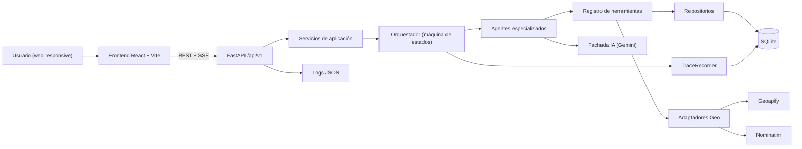
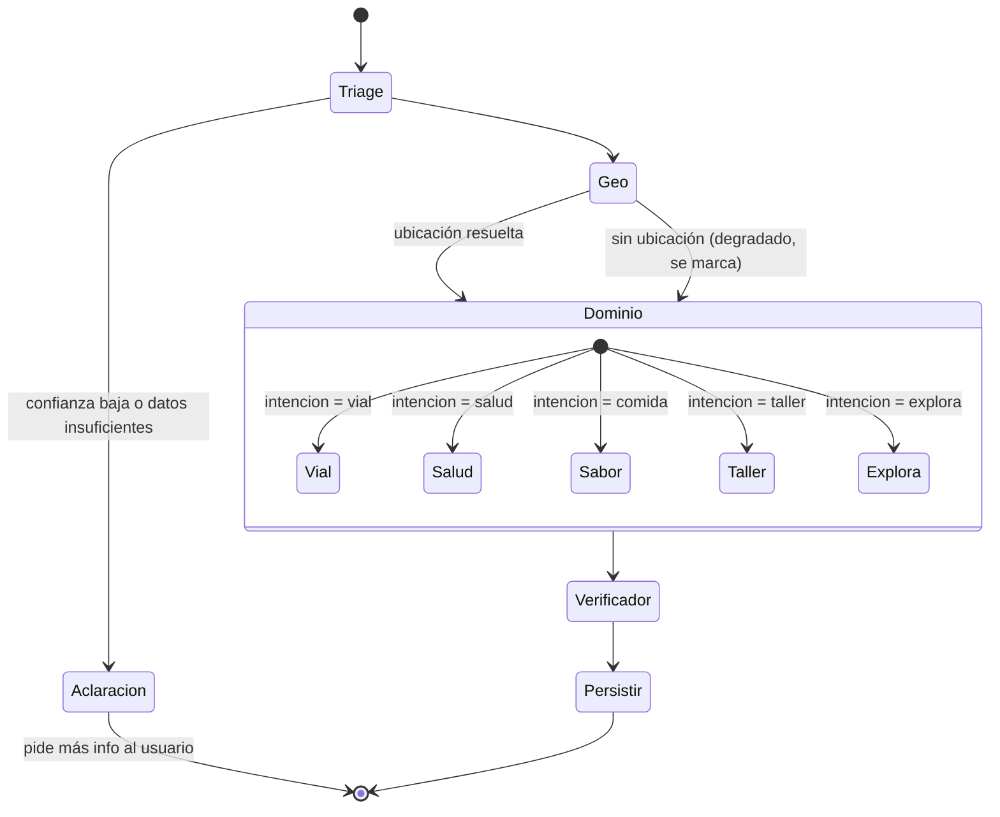
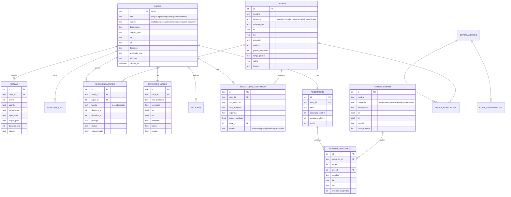
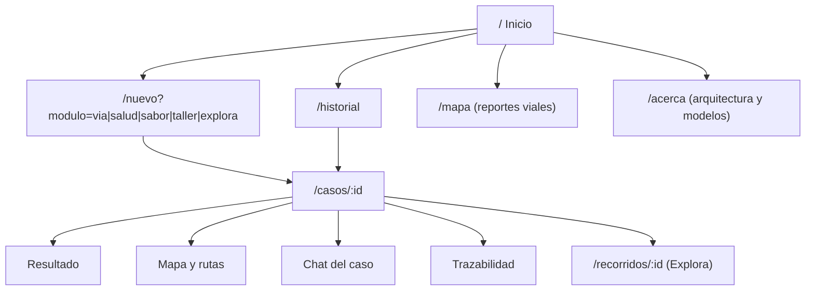

# Plan técnico — ORBIS · Asistente Urbano Inteligente

> Proyecto final Unidad III: *Solución inteligente multimodal con herramientas, geolocalización y agentes*
> Carpeta de trabajo: `E:\Ia_integrada\Proyecto Inteligencia Artificial`
> Base de partida: `ia-integrada-incidentes-main` (FastAPI + Gemini + React/Vite)
> Sustentación: **17 de octubre de 2026**

> [!NOTE]
> "ORBIS" es un nombre provisional. La ciudad base que asumo es **Bogotá** (los datos propios de ejemplo y la línea de emergencias **123** dependen de esto). Ver *Preguntas abiertas* al final.

---

## 1. Alcance y usuarios

| Módulo | Necesidad del usuario | Resultado del sistema | Acción ejecutada (Fase 4) |
|---|---|---|---|
| **Vía** · Problemas viales | "Hay un hueco enorme aquí" + foto + ubicación | Tipo de daño, severidad, ubicación exacta (dirección/barrio), entidad sugerida | **Crea un reporte vial** persistido y visible en el mapa público |
| **Salud** · Orientación | "Me duele mucho el pecho y el brazo izquierdo" (+ foto opcional) | Especialidad sugerida, nivel de urgencia, señales de alarma, **pasos para mantenerse estable**, centros cercanos especializados con distancia/tiempo | **Guarda la recomendación** y el centro elegido; genera la ruta |
| **Sabor** · Comida | "Tengo antojo de ramen, máximo 40 mil" (+ foto de un plato opcional) | Tipo de cocina, presupuesto, mejores lugares cercanos con precio, distancia y motivo | **Guarda el lugar elegido** como recomendación/favorito |
| **Taller** · Asistencia vehicular | "Se me pinchó la llanta en la Av. Boyacá" + foto del daño o del tablero | Falla probable, urgencia, ¿puedo seguir conduciendo?, pasos de seguridad, talleres/montallantas cercanos según la falla y el tipo de vehículo | **Crea una solicitud de asistencia** (abierta → asignada → atendida) y guarda el taller elegido |
| **Explora** · Turismo y recorridos | Foto de un monumento o calle + "tengo 2 horas, me gusta la historia" | Lugar identificado con nivel de confianza, contexto verificado, recorrido a pie ordenado con tiempos por parada | **Guarda el recorrido** (paradas, orden, distancia y duración total) |

**Usuarios:** ciudadanos (móvil primero) y un rol de consulta (docente/evaluador) que revisa historial, mapa y trazabilidad.

> [!WARNING]
> El módulo de Salud **no diagnostica**. Una regla determinista (no el LLM) detecta señales de alarma y fuerza "EMERGENCIA → llama al 123". Las recomendaciones de estabilización salen de una **tabla curada de guías** en la BD; el LLM solo las selecciona y adapta.
> Igual en **Taller**: reglas fijas detectan riesgos (humo o fuego, olor a gasolina, falla de frenos, varado en vía rápida) y ordenan "detente, aléjate del vehículo, llama al 123" antes de cualquier sugerencia. En **Explora**, si la confianza del reconocimiento es baja, el sistema pide confirmar el lugar en vez de inventarlo.

---

## 2. Cumplimiento de la rúbrica

| Fase | Cómo se cumple |
|---|---|
| 1. Arquitectura | Secciones 3–4 (diagramas reales del código implementado) |
| 2. Multimodal + estructurado | Texto + imagen (daño vial, síntomas, plato, falla del vehículo, monumento) + GPS/EXIF. Esquemas Pydantic por dominio. Campo `calidad_informacion` detecta datos insuficientes, contradictorios o fuera de contexto |
| 3. Datos propios + geo | SQLite con lugares, especialidades, guías, precios, reportes, talleres por servicio y puntos de interés. **Geoapify** (lugares + rutas) y **Nominatim** (geocodificación/inversa) |
| 4. Herramientas y acciones | ≥14 herramientas; acciones reales: crear reporte vial, crear solicitud de asistencia, guardar recorrido, guardar recomendación, seleccionar lugar |
| 5. Chat contextual | Chat por caso con contexto: caso + datos propios + salidas de herramientas (grounding estricto) |
| 6. Agentes y orquestación | 8 agentes con responsabilidades separadas + orquestador determinista (máquina de estados) |
| 7. Persistencia y trazabilidad | Tablas `casos`, `acciones`, `trazas` (agente, herramienta, input, output, ms, estado). Vista "Cómo se obtuvo este resultado" |

---

## 3. Stack

| Capa | Tecnología | Justificación |
|---|---|---|
| Backend | **Python 3.13 + FastAPI** (async) | Continuidad con el proyecto base; async para I/O de IA y mapas |
| Validación/config | Pydantic v2 + `pydantic-settings` | Esquemas de respuesta estructurada y config por entorno |
| ORM / BD | **SQLAlchemy 2.0 async + aiosqlite + SQLite** (WAL) · Alembic | Requisito SQLite; migrable a Postgres cambiando `DATABASE_URL` |
| IA | **Google GenAI SDK** · `gemini-2.5-flash` (agentes multimodales, function calling, JSON schema) · `gemini-2.5-flash-lite` (chat) | Multimodal, salida estructurada, latencia y costo bajos, cuota gratuita |
| Geo | **Geoapify** (Places, Routing, Geocoding) · **Nominatim** (fallback/reverse) | 3.000 créditos/día gratis, categorías `healthcare.*`, `catering.*`, `service.vehicle.*` y `tourism.*` |
| Contexto turístico | **Wikipedia REST API** (resúmenes en español) | Gratis y sin clave; datos verificables para Explora |
| HTTP | `httpx.AsyncClient` (pool) + `tenacity` (reintentos/backoff) | Resiliencia ante APIs externas |
| Imagen | Pillow (EXIF GPS, redimensionado) | Ubicación desde la foto + validación de coherencia |
| Logs | `structlog` (JSON) + rotación de archivos | Observabilidad técnica |
| Seguridad | `slowapi` (rate limit), CORS por entorno, validación MIME/tamaño | Producción |
| Tests | `pytest`, `pytest-asyncio`, `respx` (mocks HTTP) | Agentes y herramientas probados sin gastar cuota |
| Frontend | **React 19 + Vite + React Router + TanStack Query** | SPA rápida con caché de datos |
| Estilos | **CSS vanilla con tokens** (custom properties) + CSS Modules | Control total del sistema de diseño |
| Mapa | **Leaflet** + tiles OSM/CARTO (dark/light), carga diferida | Ligero, gratuito |
| Markdown | `react-markdown` | Respuestas del chat |

---

## 4. Arquitectura

### 4.1 Vista general



### 4.2 Capas (Clean / Hexagonal ligera)

```
api (routers, DTOs)  →  services (casos de uso)  →  orchestrator → agents → tools
                                                         ↓            ↓
                                                   providers (IA, Geo)   repositories → SQLite
```
Regla: cada capa solo conoce a la de abajo mediante **interfaces** (`Protocol`), inyectadas con `Depends`.

### 4.3 Patrones de diseño

| Patrón | Dónde | Beneficio |
|---|---|---|
| **Repository + Unit of Work** | `repositories/*`, sesión por request | BD intercambiable, pruebas fáciles |
| **Strategy** | Agentes de dominio (Vía/Salud/Sabor) | Añadir dominios sin tocar el orquestador |
| **Registry / Factory** | `AgentRegistry`, `ToolRegistry` | Descubrimiento y declaración de herramientas para function calling |
| **Adapter** | `GeoProvider` → `GeoapifyAdapter`, `NominatimAdapter` | Cambiar de proveedor sin afectar agentes |
| **Facade** | `AIClient` sobre Gemini | Un punto para modelo, reintentos, esquemas y métricas |
| **Pipeline / State Machine** | `Orchestrator` | Orden y condiciones explícitas y auditables |
| **Observer** | `TraceRecorder` escucha eventos de agentes/herramientas | Trazabilidad + streaming SSE al frontend |
| **Circuit Breaker + Retry** | Llamadas a Geo/IA | Degradación elegante (fallback a Nominatim / datos propios) |
| **Cache-aside (TTL)** | Geocodificación y lugares | Respeta límites (Nominatim 1 req/s) y baja latencia |
| **Chain of Responsibility** | Reglas de seguridad de Salud antes del LLM | Señales de alarma con prioridad absoluta |

---

## 5. Agentes y orquestación (Fase 6)

| Agente | Responsabilidad | Recibe | Herramientas | Produce |
|---|---|---|---|---|
| **1. Triage** | Clasificar intención y validar calidad de la entrada | Texto, imagen, ubicación | `extraer_exif_gps` | `intencion`, `confianza`, entidades, `calidad_informacion` |
| **2. Geoespacial** | Resolver dónde está el usuario/problema | Ubicación declarada, GPS navegador, EXIF | `geocodificar`, `geocodificar_inversa` | Coordenadas, dirección, barrio, fuente y conflictos |
| **3a. Vial** | Diagnosticar el daño y registrar el reporte | Salida 1+2, imagen | `consultar_reportes_cercanos`, **`crear_reporte_vial`** | Tipo, severidad, riesgo, duplicados, `reporte_id` |
| **3b. Salud** | Orientar especialidad, urgencia y estabilización | Salida 1+2, síntomas | `evaluar_senales_alarma` (reglas), `consultar_especialidades`, `consultar_guias_estabilizacion`, `buscar_centros_cercanos`, `calcular_ruta` | Urgencia, especialidad, pasos, centros rankeados |
| **3c. Sabor** | Encontrar los mejores lugares por antojo y precio | Salida 1+2, presupuesto, foto | `consultar_lugares_propios`, `buscar_lugares_cercanos`, `calcular_ruta` | Ranking con precio, distancia, motivo |
| **3d. Taller** | Diagnóstico preliminar de la falla y gestión de la asistencia | Salida 1+2, foto del daño/tablero, tipo de vehículo | `evaluar_riesgo_vehicular` (reglas), `consultar_talleres_propios`, `buscar_lugares_cercanos` (`service.vehicle.*`), `calcular_ruta`, **`crear_solicitud_asistencia`** | Falla probable, urgencia, `puede_conducir`, pasos de seguridad, talleres rankeados, `solicitud_id` |
| **3e. Explora** | Identificar el lugar de la foto y diseñar un recorrido | Foto, ubicación, tiempo disponible, intereses | `consultar_puntos_interes`, `buscar_lugares_cercanos` (`tourism.*`), `consultar_wikipedia`, `optimizar_recorrido`, **`guardar_recorrido`** | Lugar + confianza, paradas ordenadas, distancia/duración, `recorrido_id` |
| **4. Verificador/Sintetizador** | Unir resultados y **eliminar lo no verificado** | Todo lo anterior + trazas | — | `RespuestaFinal` estructurada + markdown |

### Flujo del orquestador



- El orquestador es **código** (no un prompt): decide el siguiente paso según el estado.
- Cada paso emite eventos `step.started / tool.called / step.finished` → tabla `trazas` + **SSE** para mostrar el progreso en vivo.
- Salud: si `evaluar_senales_alarma` = emergencia, se responde de inmediato con 123 + centro más cercano de urgencias, sin esperar al resto. Lo mismo en Taller con `evaluar_riesgo_vehicular`.
- Explora: `optimizar_recorrido` ordena las paradas con vecino más cercano sobre una matriz de tiempos a pie (Geoapify) y recorta hasta ajustarse al tiempo disponible.

---

## 6. Herramientas (Fase 4)

| Herramienta | Tipo | Fuente |
|---|---|---|
| `consultar_lugares_propios(categoria, lat, lon, radio, precio_max)` | Datos propios | SQLite |
| `consultar_especialidades(sintomas)` / `consultar_guias_estabilizacion(condicion)` | Datos propios | SQLite |
| `consultar_reportes_cercanos(lat, lon, radio)` | Datos propios | SQLite |
| `consultar_talleres_propios(servicio, tipo_vehiculo, lat, lon)` | Datos propios | SQLite |
| `consultar_puntos_interes(lat, lon, radio, intereses)` | Datos propios | SQLite |
| `geocodificar(texto)` / `geocodificar_inversa(lat, lon)` | Geo externa | Geoapify → fallback Nominatim |
| `buscar_lugares_cercanos(categoria, lat, lon, radio)` | Geo externa | Geoapify Places |
| `calcular_ruta(origen, destino, modo)` | Geo externa | Geoapify Routing |
| `extraer_exif_gps(imagen)` | Local | Pillow |
| `consultar_wikipedia(titulo)` | Externa | Wikipedia REST (es) |
| `evaluar_riesgo_vehicular(texto, hallazgos)` | Local (reglas) | Tabla `reglas_riesgo_vehicular` |
| `optimizar_recorrido(paradas, origen, minutos)` | Local + Geo | Matriz de tiempos Geoapify |
| **`crear_reporte_vial(...)`** | **Acción** | SQLite |
| **`guardar_recomendacion(caso_id, lugar)`** / **`seleccionar_lugar`** | **Acción** | SQLite |
| **`crear_solicitud_asistencia(...)`** / **`actualizar_estado_solicitud`** | **Acción** | SQLite |
| **`guardar_recorrido(caso_id, paradas)`** | **Acción** | SQLite |

---

## 7. Datos (SQLite)



- Otras tablas: `especialidades`, `lugar_especialidad`, `guias_estabilizacion`, `servicios_taller` (llantas, eléctrico, frenos, motor, grúa), `reglas_riesgo_vehicular`, `mensajes_chat`, `acciones`.
- PRAGMAs: `journal_mode=WAL`, `foreign_keys=ON`, `busy_timeout=5000`. Índices en `lugares(categoria, lat, lon)`, `puntos_interes(lat, lon)`, `trazas(caso_id, orden)`, `casos(creado_en)`.
- **Seed**: ~40 lugares de salud y comida, ~20 talleres/montallantas con servicios y tipo de vehículo, ~30 puntos de interés (La Candelaria, centro, Usaquén), 15 especialidades, 20 guías de estabilización, 12 reglas de riesgo vehicular.
- Precios: los de Geoapify no traen precio → se muestran como "precio no verificado". Solo los datos propios muestran precio confirmado.

---

## 8. API (`/api/v1`)

| Método | Ruta | Descripción |
|---|---|---|
| GET | `/health` | Estado de BD, IA y proveedores Geo |
| POST | `/casos` | Multipart: `descripcion`, `imagen?`, `lat?`, `lon?`, `direccion?`, `tipo?` → `202 {caso_id}` |
| GET | `/casos/{id}/eventos` | **SSE** progreso de agentes en vivo |
| GET | `/casos/{id}` | Caso + resultado estructurado + acciones |
| GET | `/casos?tipo=&page=&size=` | Historial paginado |
| GET | `/casos/{id}/trazas` | Trazabilidad completa |
| POST / GET | `/casos/{id}/chat` | Chat contextual |
| POST | `/casos/{id}/recomendaciones/{rec_id}/seleccionar` | Acción: elegir lugar/centro/taller |
| PATCH | `/solicitudes-asistencia/{id}` | Acción: cambiar estado (asignada/atendida/cancelada) |
| GET | `/recorridos/{id}` | Recorrido con paradas y geometría de la ruta |
| GET | `/puntos-interes?lat=&lon=&radio=` | Datos propios turísticos |
| GET | `/reportes-viales?bbox=` | Reportes para el mapa |
| GET | `/lugares?categoria=&lat=&lon=&radio=` | Datos propios |
| GET | `/geo/reverse?lat=&lon=` | Dirección desde el navegador |

Errores con formato único `{"error": {"codigo", "mensaje", "request_id"}}` y **códigos HTTP reales** (corrige el problema del proyecto base, donde los errores volvían como 200 y el frontend los ocultaba).

### Respuesta estructurada (común + dominio)

```json
{
  "caso_id": "…",
  "intencion": "salud",
  "confianza": 0.91,
  "resumen": "…",
  "observacion_imagen": "…",
  "ubicacion": { "texto": "Cra 7 #45-10, Chapinero", "lat": 4.63, "lon": -74.06, "fuente": "gps|exif|texto" },
  "calidad_informacion": { "suficiente": true, "contradicciones": [], "datos_faltantes": [], "fuera_de_contexto": false },
  "salud": {
    "nivel_urgencia": "urgente",
    "especialidad_sugerida": "Cardiología",
    "senales_alarma": ["…"],
    "recomendaciones_estabilizacion": ["…"],
    "que_no_hacer": ["…"],
    "centros": [{ "nombre": "…", "distancia_m": 1800, "duracion_s": 420, "telefono": "…", "fuente": "propia" }],
    "aviso": "Esta orientación no reemplaza la valoración médica."
  },
  "acciones": [{ "tipo": "guardar_recomendacion", "estado": "ejecutada", "id": "…" }]
}
```
Bloques equivalentes:
- `vial {tipo_problema, severidad, riesgo, entidad_sugerida, duplicados_cercanos, reporte_id}`
- `comida {antojo, tipo_cocina, presupuesto_max, restricciones, lugares[{nombre, precio_promedio, precio_verificado, rating, distancia_m, motivo}]}`
- `taller {tipo_vehiculo, falla_probable, testigos_detectados[], urgencia, puede_conducir, pasos_seguridad[], que_no_hacer[], talleres[{nombre, servicios[], distancia_m, duracion_s, telefono}], solicitud_id}`
- `explora {lugar_identificado, confianza, requiere_confirmacion, contexto, fuente_contexto, tiempo_disponible_min, intereses[], paradas[{orden, nombre, minutos_sugeridos, distancia_desde_anterior_m}], distancia_total_m, duracion_total_s, recorrido_id}`

---

## 9. Arquitectura de información



Navegación: barra superior en desktop, **barra inferior** en móvil (Inicio · Nuevo · Mapa · Historial). Botón de emergencia 123 siempre visible en los módulos Salud y Taller.

---

## 10. Viajes de usuario

| Etapa | Vía (Andrés, conductor) | Salud (Laura, oficina) | Sabor (Camila, almuerzo) |
|---|---|---|---|
| Disparador | Ve un hueco peligroso | Dolor fuerte y mareo | Tiene hambre y poco tiempo |
| Entrada | Foto + "hueco grande en el carril derecho" + GPS | Texto de síntomas + ubicación | "Algo de sushi, máx 50 mil" + foto opcional |
| Proceso visible | Timeline en vivo: Triage → Ubicación → Diagnóstico vial | Si hay alarma: banner rojo 123 inmediato; si no, timeline normal | Timeline + tarjetas que aparecen al terminar |
| Resultado | Severidad alta, dirección exacta, reporte #RV-0042 creado | Urgencia, especialidad, 4 pasos para estabilizarse, 3 centros con tiempo de llegada | 5 lugares con precio, distancia, rating y motivo |
| Acción | Ver en mapa público / compartir | "Ir a este centro" → ruta guardada | "Elegir" → guardado en favoritos |
| Seguimiento | Chat: "¿Ya hay otros reportes aquí?" | Chat: "¿Puedo tomar agua?" (respuesta limitada a guías) | Chat: "¿Cuál tiene opciones vegetarianas?" |
| Emoción objetivo | Útil, escuchado | Calmado, guiado | Antojo resuelto rápido |

| Etapa | Taller (Diego, varado) | Explora (Sofía, turista) |
|---|---|---|
| Disparador | Llanta pinchada en la Av. Boyacá | Tiene 2 horas libres en el centro |
| Entrada | Foto de la llanta + "carro particular" + GPS | Foto de una iglesia + "me gusta la historia, 2 horas" |
| Proceso visible | Si hay riesgo: banner "aléjate del vehículo, 123"; si no, timeline | Timeline: Triage → Reconocimiento → Contexto → Recorrido |
| Resultado | "No conduzcas más de 200 m", 4 pasos de seguridad, 3 montallantas con tiempo de llegada | "Iglesia de San Francisco (92%)", resumen verificado, recorrido de 4 paradas, 3,1 km |
| Acción | "Solicitar asistencia" → solicitud #AS-0007 abierta | "Guardar recorrido" → recorrido en su historial y mapa |
| Seguimiento | Chat: "¿Cuál abre los domingos?" | Chat: "¿Cuál de estos lugares es gratis?" |
| Emoción objetivo | Seguro, acompañado | Curiosa, inspirada |

---

## 11. Planos (wireframes)

**Inicio — desktop**
```
┌──────────────────────────────────────────────────────────────┐
│ ◆ ORBIS        Inicio  Mapa  Historial         ☾/☀  [Nuevo] │
├──────────────────────────────────────────────────────────────┤
│  La ciudad, entendida.                                       │
│  Reporta, oriéntate y descubre con IA.                       │
│  ┌──────────────────────────────────────────────┐  [ → ]     │
│  │ ¿Qué necesitas? Describe o arrastra una foto │            │
│  └──────────────────────────────────────────────┘            │
│  ┌────────┐ ┌────────┐ ┌────────┐ ┌────────┐ ┌────────┐      │
│  │  VÍA   │ │ SALUD  │ │ SABOR  │ │ TALLER │ │EXPLORA │      │
│  │Reportar│ │Orientar│ │Descubre│ │ Asiste │ │Recorre │      │
│  └────────┘ └────────┘ └────────┘ └────────┘ └────────┘      │
│  Actividad reciente · mini-mapa de reportes                  │
└──────────────────────────────────────────────────────────────┘
```

**Caso — desktop (3 columnas)**
```
┌──────────────┬─────────────────────────────┬─────────────────┐
│ ENTRADA      │ RESULTADO                   │ MAPA            │
│ texto        │ [Urgencia ▲ ALTA] [Cardio]  │  ● tú  ◆ centros│
│ foto         │ Pasos para estabilizarte    │                 │
│ ubicación    │ 1. … 2. … 3. …              ├─────────────────┤
│              │ Centros recomendados        │ CHAT DEL CASO   │
│ TIMELINE     │ ▸ Clínica X 1.8km 7min [Ir] │ …               │
│ ✓ Triage     │ Calidad de la información   │ [pregunta…][→]  │
│ ✓ Geo        │ ⚠ falta: edad               │                 │
│ ● Salud      │ [Ver trazabilidad]          │                 │
└──────────────┴─────────────────────────────┴─────────────────┘
```

**Caso — móvil**: cabecera con estado → pestañas `Resultado | Mapa | Chat | Traza` → CTA fija inferior ("Ir al centro" / "Ver reporte" / "Elegir lugar" / "Solicitar asistencia" / "Guardar recorrido"). En móvil los 5 módulos del inicio se muestran en cuadrícula de 2 columnas.

**Explora — recorrido (móvil)**
```
┌────────────────────────────┐
│ ← Recorrido · 2 h · 3,1 km │
│ [foto] Iglesia San Fco.    │
│ Identificado · 92 %  ✓     │
│ ┌────────────────────────┐ │
│ │  mapa con la ruta      │ │
│ │  ①──②──③──④            │ │
│ └────────────────────────┘ │
│ ① Museo del Oro    · 40 min│
│ ② Plaza de Bolívar · 15 min│
│ ③ Museo Botero     · 45 min│
│ [ Guardar recorrido ]      │
└────────────────────────────┘
```

> [!TIP]
> Al aprobar el plan puedo generar **mockups visuales** de alta fidelidad (dark y light) para validar la dirección de arte antes de codificar.

---

## 12. Sistema de diseño

**Concepto:** *"Lujo urbano nocturno"* — negro tinta, oro champán y jade; serif editorial con sans técnica; vidrio sutil, mucho aire, movimiento sobrio.

### 12.1 Color (tokens)

| Token | Dark | Light | Uso |
|---|---|---|---|
| `--bg` | `#0B0D12` | `#FAF8F4` | Fondo |
| `--surface-1` | `#12151C` | `#FFFFFF` | Tarjetas |
| `--surface-2` | `#1A1E27` | `#F2EFE8` | Elevación |
| `--border` | `#2A2F3A` | `#E3DED3` | Bordes |
| `--text` | `#F5F3EE` | `#14161C` | Texto principal |
| `--text-muted` | `#A8A49C` | `#5C5A55` | Secundario |
| **`--primary`** (Oro champán) | `#C9A45C` | `#8A6A2F` | CTA, foco, marca |
| `--on-primary` | `#0B0D12` | `#FFFFFF` | Texto sobre primario |
| **`--secondary`** (Jade) | `#4FC1A0` | `#1F7A62` | Acentos, estados activos |
| `--accent-via` | `#E8A23A` | `#9A5B00` | Módulo Vía |
| `--accent-salud` | `#F07167` | `#B42318` | Módulo Salud |
| `--accent-sabor` | `#D98E5F` | `#9C4A1A` | Módulo Sabor |
| `--accent-taller` | `#7FA7C9` | `#2E5A80` | Módulo Taller (azul acero) |
| `--accent-explora` | `#B79CED` | `#5B3FA8` | Módulo Explora (lavanda) |
| `--success` | `#3CCB8A` | `#137A4B` | Éxito |
| `--warning` | `#F2B640` | `#8F5B00` | Advertencia |
| `--danger` | `#FF5D5D` | `#B42318` | Error / emergencia |
| `--info` | `#6EA8FE` | `#1D5FC4` | Información |

**Neutros:** escala `ink-0 … ink-950` (12 pasos, gris cálido) de la que derivan superficies y bordes.

**Contraste (WCAG 2.2):**

| Par | Ratio aprox. | Nivel |
|---|---|---|
| `--text` / `--bg` (dark) | ≈ 18:1 | AAA |
| `--text-muted` / `--bg` (dark) | ≈ 7.8:1 | AAA |
| `--primary` / `--bg` (dark) | ≈ 8.3:1 | AAA |
| `--on-primary` / `--primary` (dark) | ≈ 8.3:1 | AAA |
| `--text` / `--bg` (light) | ≈ 17:1 | AAA |
| `--primary` / `--bg` (light) | ≈ 4.7:1 | AA |

Todos los pares se validarán con una prueba automática (script de contraste) antes de cerrar.

### 12.2 Tipografía

- **Display:** *Fraunces* (serif óptica, títulos, números grandes) → emoción y lujo.
- **UI / texto:** *Inter* (sans humanista, tabular nums) → legibilidad.
- **Datos / trazas:** *JetBrains Mono*.
- **Lógica de emparejamiento:** contraste de clasificación (serif vs sans) con proporciones similares de altura x; el serif solo en ≥ `--fs-xl`, el sans en todo lo funcional; la mono solo en datos técnicos.

**Escala de 9 pasos (ratio 1.25, base 16px, fluida con `clamp`)**

| Paso | Token | Tamaño | Interlineado | Uso |
|---|---|---|---|---|
| 1 | `--fs-2xs` | 12px | 1.4 | Etiquetas, captions |
| 2 | `--fs-xs` | 14px | 1.45 | Metadatos |
| 3 | `--fs-sm` | 16px | 1.55 | Texto base |
| 4 | `--fs-md` | 20px | 1.5 | Lead |
| 5 | `--fs-lg` | 25px | 1.35 | H4 |
| 6 | `--fs-xl` | clamp(26px, 2.4vw, 31px) | 1.25 | H3 |
| 7 | `--fs-2xl` | clamp(30px, 3.2vw, 39px) | 1.2 | H2 |
| 8 | `--fs-3xl` | clamp(36px, 4.4vw, 49px) | 1.1 | H1 internas |
| 9 | `--fs-4xl` | clamp(44px, 6vw, 61px) | 1.02 | Hero |

Tracking: −0.02em en display, +0.08em en etiquetas en mayúscula.

### 12.3 Responsive

- Mobile‑first. Breakpoints: `sm 640` · `md 960` · `lg 1280` · `xl 1600`.
- Grid fluida 4/8/12 columnas; espaciado en escala de 4px (`--space-1…12`).
- **Container queries** en tarjetas de lugar y resultado.
- Caso: 1 columna con pestañas (<960) · 2 columnas (960–1280) · 3 columnas (≥1280).
- Áreas táctiles ≥ 44×44px.

### 12.4 Movimiento

| Token | Valor | Uso |
|---|---|---|
| `--dur-instant` | 80ms | Pulsado |
| `--dur-fast` | 160ms | Hover, toggles |
| `--dur-base` | 240ms | Tarjetas, tabs |
| `--dur-slow` | 420ms | Paneles, modales |
| `--dur-deliberate` | 700ms | Entradas de hero |
| `--ease-standard` | `cubic-bezier(0.2, 0, 0, 1)` | General |
| `--ease-enter` | `cubic-bezier(0.16, 1, 0.3, 1)` | Entradas (expo‑out) |
| `--ease-exit` | `cubic-bezier(0.7, 0, 0.84, 0)` | Salidas |
| `--ease-spring` | `cubic-bezier(0.34, 1.56, 0.64, 1)` | Confirmaciones |

**Microinteracciones:** botón magnético + brillo dorado en hover · zona de foto con borde animado al arrastrar · timeline de agentes con pulso del paso activo y check animado · tarjetas que entran escalonadas (stagger 40ms) · pin del mapa que "cae" · conmutador dark/light con transición de color · skeletons con shimmer.
`prefers-reduced-motion` → solo fundidos de opacidad.

### 12.5 Accesibilidad (WCAG 2.2 AA)

- Contraste ≥ 4.5:1 en texto y ≥ 3:1 en componentes y foco.
- Foco visible: anillo de 2px `--primary` con 2px de separación.
- Navegación completa por teclado, enlace "Saltar al contenido", orden lógico.
- `aria-live="polite"` en el timeline de agentes; `assertive` en alarmas de salud.
- La severidad/urgencia nunca se comunica solo con color (icono + texto).
- El mapa tiene una lista alternativa accesible de los mismos puntos.
- Formularios con `label`, mensajes de error asociados (`aria-describedby`).
- `lang="es-CO"`, textos alternativos y `prefers-color-scheme` respetado.

---

## 13. Rendimiento

| Área | Medida |
|---|---|
| Subida | Compresión en el navegador (máx 1600px, WebP ~85%) → la foto de 7MB del proyecto base pasa a ~300KB. Límite servidor 5MB + validación MIME |
| Percepción | `POST /casos` responde 202 y el progreso llega por SSE; los resultados se muestran a medida que terminan |
| Paralelismo | `asyncio.gather` para geo + datos propios; rutas calculadas en paralelo para el top‑3 |
| Caché | TTL para geocodificación (24h) y lugares (1h); throttling de 1 req/s para Nominatim |
| BD | WAL, índices, paginación, consultas por bounding box antes de calcular distancia (Haversine) |
| Frontend | Code splitting por ruta, Leaflet diferido, fuentes `font-display: swap` + preload, imágenes `loading=lazy` |
| Presupuestos | LCP < 2.5s · INP < 200ms · CLS < 0.1 · JS inicial < 180KB gzip · Lighthouse ≥ 90 |

## 14. Logs y observabilidad

- **Logs técnicos** (`structlog`, JSON): `timestamp, level, request_id, caso_id, agente, herramienta, duracion_ms, evento`. Consola en desarrollo, archivo rotativo `logs/app.log` en producción.
- Middleware `X-Request-ID` que se propaga a los logs y a las respuestas de error.
- Redacción automática de claves y datos sensibles (síntomas no van a logs, solo a la BD).
- **Trazabilidad funcional** (tabla `trazas`) separada de los logs técnicos: es la que ve el usuario/evaluador.
- `/health` con el estado de cada dependencia.

## 15. Escalabilidad

- API sin estado → varias instancias detrás de un balanceador.
- `DATABASE_URL` → migración a PostgreSQL sin cambiar repositorios.
- Las tareas de orquestación corren hoy en `BackgroundTasks`; la interfaz permite moverlas a una cola (Arq/Celery + Redis).
- Nuevos dominios (p. ej. "Transporte") = nuevo agente Strategy + registro, sin tocar el orquestador.
- Proveedores de IA y Geo intercambiables mediante Adapter/Facade.
- Rate limiting por IP y configuración por entorno (`dev`, `prod`).

## 16. SEO

- `<title>` y `<meta description>` por ruta (soporte nativo de React 19), un solo `<h1>` por página, HTML semántico.
- Open Graph/Twitter cards, `manifest.webmanifest` (PWA instalable), `theme-color` dark/light.
- `robots.txt` y `sitemap.xml` para páginas públicas (`/`, `/mapa`, `/acerca`); `/casos/*` con `noindex` (privacidad).
- Datos estructurados JSON‑LD `WebApplication` en el inicio.

---

## 17. Estructura de carpetas

```
Proyecto Inteligencia Artificial/
├── backend/
│   ├── app/
│   │   ├── main.py
│   │   ├── core/          # config, logging, db, errores, seguridad
│   │   ├── api/v1/        # routers: casos, chat, lugares, reportes, geo, health
│   │   ├── schemas/       # Pydantic: entrada, respuestas estructuradas por dominio
│   │   ├── models/        # SQLAlchemy
│   │   ├── repositories/
│   │   ├── services/      # casos de uso
│   │   ├── orchestrator/  # máquina de estados + TraceRecorder + eventos SSE
│   │   ├── agents/        # triage, geo, vial, salud, sabor, taller, explora, verificador
│   │   ├── tools/         # registro y herramientas
│   │   ├── providers/     # ai/gemini.py, geo/geoapify.py, geo/nominatim.py
│   │   └── seed/          # datos propios de Bogotá
│   ├── tests/
│   ├── requirements.txt
│   └── .env.example
├── frontend/
│   ├── public/            # robots, sitemap, manifest, íconos
│   └── src/
│       ├── styles/        # tokens.css, base.css, motion.css
│       ├── components/    # Button, Card, Badge, Timeline, Map, Uploader, Chat…
│       ├── features/      # via, salud, sabor, taller, explora, casos, historial, mapa
│       ├── pages/
│       ├── hooks/         # useCaseStream (SSE), useGeolocation, useTheme
│       └── services/      # cliente API
├── docs/                  # este plan, diagramas, decisiones (ADR)
├── README.md
└── iniciar_sistema.bat
```

---

## 18. Cronograma (hasta el 17 de octubre)

| Días | Entregable |
|---|---|
| 4–5 oct | Andamiaje backend (capas, BD, seed, logs) + tokens de diseño y layout base |
| 6–7 oct | Proveedores Geo + IA, herramientas, agentes Triage y Geo, orquestador + trazas |
| 8 oct | Agentes Vía y Salud (reglas de alarma) + acciones |
| 9 oct | Agentes Sabor, Taller (reglas de riesgo) y Explora (Wikipedia + optimizador de recorrido) + acciones |
| 10–11 oct | Frontend: inicio, nuevo caso, página de caso con SSE, mapa |
| 12 oct | Chat contextual + historial + vista de trazabilidad |
| 13 oct | Responsive, accesibilidad, rendimiento (Lighthouse), SEO |
| 14 oct | Pruebas, manejo de errores, `.env.example` |
| 15–16 oct | README final, guion de demo, ensayo de sustentación |

---

## Preguntas abiertas

1. **Ciudad base**: ¿Bogotá? (afecta datos propios, mapa inicial y línea 123).
2. **API Geoapify**: ¿ya tienes una clave o la creamos? (es gratis, sin tarjeta). Nominatim no requiere clave.
3. **Nombre** del producto: ¿te sirve "ORBIS" o tienes otro?
4. **Lenguaje del frontend**: ¿JavaScript (como el proyecto base) o TypeScript (recomendado para producción)?
5. **README**: nombres de los integrantes del grupo y enlace del repositorio de GitHub.
