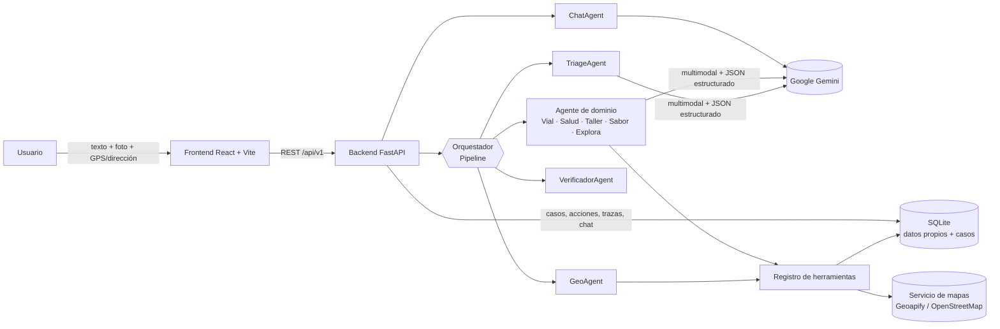

# ORBIS · Asistente Urbano Inteligente para Bogotá

Aplicación web de **movilidad y localización de servicios urbanos** con IA multimodal, geolocalización, herramientas y agentes especializados.

El usuario describe una necesidad (texto), puede adjuntar una **foto** e indicar su **ubicación** (GPS o dirección). ORBIS analiza el caso, consulta **datos propios** y un **servicio externo de mapas**, coordina **agentes especializados**, **ejecuta una acción** dentro del sistema (crear un reporte, abrir una solicitud, guardar un recorrido o una recomendación), y permite seguir preguntando en un **chat contextual**. Cada paso queda **persistido y trazado**.

> Proyecto final · Unidad III · Inteligencia de Negocios · UNIMINUTO
> Integrantes: Juan Pablo Guillen, Cristian Orlando Avila, Andrés Felipe Bohórquez Bernal
> Docente: Zaida Patricia Ojeda Guzman

---

## 1. Alcance y usuarios

**Usuarios:** ciudadanos de Bogotá (peatones, conductores, turistas) que necesitan orientación rápida sobre un problema o servicio cercano.

| Módulo | Ejemplo de solicitud | Resultado | Acción ejecutada |
|---|---|---|---|
| **Vía** | "Hay un hueco enorme" + foto | Tipo de daño, severidad, riesgo, entidad responsable, reportes duplicados cercanos | Crea un **reporte vial** (visible en el tablero de calor) |
| **Salud** | "Me duele el pecho y el brazo izquierdo" | Nivel de urgencia, especialidad, señales de alarma, qué hacer / qué no hacer, centros cercanos con ruta real | Guarda la **recomendación** del centro más rápido |
| **Taller** | "Mi carro echa humo" + foto del tablero | Falla probable, urgencia, si puede conducir, pasos de seguridad, talleres cercanos | Abre una **solicitud de asistencia** |
| **Sabor** | "Antojo de hamburguesa, máximo 40 mil" | Restaurantes cercanos con motivo, precio (solo si está verificado) y ruta a pie | Guarda la **recomendación** principal |
| **Explora** | "Tengo 3 horas en La Candelaria" | Recorrido ordenado con tiempo de visita y rutas a pie entre paradas | Guarda el **recorrido** |

ORBIS **no diagnostica** enfermedades ni reemplaza a los servicios de emergencia: ante señales de alarma siempre indica llamar al **123**.

---

## 2. Arquitectura implementada



| Componente | Tecnología | Ubicación |
|---|---|---|
| Interfaz web | React 19 + TypeScript + Vite, TanStack Query, React Router, Leaflet | `frontend/` |
| Backend | FastAPI (async), Pydantic v2, SQLAlchemy 2 (async) | `backend/app/` |
| Modelo de IA | Google Gemini vía `google-genai` | `backend/app/providers/ai.py` |
| Datos propios | SQLite: lugares, especialidades, guías de estabilización, puntos de interés, reportes | `backend/app/models/domain.py`, `backend/app/seed/` |
| Servicio de mapas | **Geoapify** (geocodificación, lugares, rutas). Si no hay clave: **OpenStreetMap** (Nominatim, Overpass, OSRM de FOSSGIS) | `backend/app/providers/geo.py` |
| Herramientas | Registro central de funciones que usan los agentes | `backend/app/tools/` |
| Agentes y orquestación | `Pipeline` determinista + agentes con responsabilidades separadas | `backend/app/agents/`, `backend/app/orchestrator/` |
| Persistencia y trazas | Tablas `casos`, `trazas`, `mensajes_chat`, `reportes_viales`, `solicitudes_asistencia`, `recorridos`, `recomendaciones` | `backend/app/models/domain.py` |

### Flujo de un caso

1. El frontend envía `POST /api/v1/casos` (multipart: descripción, imagen opcional, GPS o dirección). La imagen se corrige de orientación, se reduce a 1600 px y se guarda en `backend/uploads/`.
2. El caso se procesa en segundo plano y el frontend consulta su estado cada 2 s.
3. **TriageAgent** → **GeoAgent** → **agente de dominio** (solo si la información es suficiente) → **VerificadorAgent**.
4. Se guardan el resultado, las acciones y la traza completa. El usuario puede abrir el chat del caso.

---

## 3. Agentes y orquestación

El orquestador (`orchestrator/pipeline.py`) es **determinista**: el orden es fijo y la **condición** para ejecutar el agente de dominio la decide el Triage (`calidad_informacion.suficiente` y `fuera_de_contexto`). La intención (`vial`, `salud`, `comida`, `taller`, `explora`) decide **qué** agente de dominio participa.

| Agente | Responsabilidad | Recibe | Herramientas | Produce |
|---|---|---|---|---|
| **TriageAgent** | Clasificar el caso y evaluar la calidad de la información | Texto, **imagen**, si hay GPS/dirección | Gemini (multimodal) | `ResultadoTriage`: intención, confianza, resumen, observación de la imagen, entidades, `calidad_informacion` (suficiente, contradicciones, datos faltantes, fuera de contexto) |
| **GeoAgent** | Resolver la ubicación y alertas de la zona | GPS o dirección escrita | `geocodificar_direccion`, `identificar_direccion`, `consultar_reportes_cercanos` | `UbicacionResuelta` + alertas comunitarias (reportes viales a < 500 m) |
| **VialAgent** | Diagnosticar daños en la vía | Texto, imagen, ubicación | `consultar_reportes_cercanos`, `crear_reporte_vial` | `ResultadoVial` + reporte creado |
| **SaludAgent** | Orientar sin diagnosticar | Síntomas, imagen, ubicación | `evaluar_senales_alarma` (reglas), `consultar_lugares_propios`, `consultar_guias_estabilizacion`, `buscar_lugares_externos`, `calcular_ruta`, `guardar_recomendacion` | `ResultadoSalud` + recomendación guardada |
| **TallerAgent** | Orientar sobre fallas del vehículo | Falla, imagen, ubicación | `evaluar_riesgo_vehicular` (reglas), `consultar_lugares_propios`, `buscar_lugares_externos`, `calcular_ruta`, `crear_solicitud_asistencia` | `ResultadoTaller` + solicitud abierta |
| **SaborAgent** | Recomendar dónde comer | Antojo, presupuesto, ubicación | `consultar_lugares_propios`, `buscar_lugares_externos`, `calcular_ruta`, `guardar_recomendacion` | `ResultadoSabor` + recomendación guardada |
| **ExploraAgent** | Armar recorridos turísticos | Intereses, tiempo, imagen, ubicación | `consultar_puntos_interes`, `calcular_ruta` (a pie), `guardar_recorrido` | `ResultadoExplora` + recorrido guardado |
| **VerificadorAgent** | Control de calidad **sin LLM** antes de responder | Salidas de todos los agentes y trazas | — | `Verificacion`: aprobado, advertencias, lugares descartados, fuentes usadas |
| **ChatAgent** | Responder preguntas de seguimiento | Resultado del caso + salidas de herramientas + historial | Gemini | Respuesta en texto, guardada en `mensajes_chat` |

**Separación real de responsabilidades:**
- Las **reglas deterministas** (alarmas médicas, riesgo vehicular) **mandan sobre el modelo**: si detectan una alarma, la urgencia no puede quedar baja.
- El modelo **no calcula distancias ni tiempos**: los calcula el servicio de mapas (`calcular_ruta`).
- El Verificador **descarta** cualquier lugar que el modelo sugiera y que no esté en los datos consultados, avisa si la ubicación no fue confirmada, si una herramienta falló o si falta información, y garantiza el mensaje del 123 en urgencias.

---

## 4. Análisis multimodal y respuesta estructurada

- Entrada: **texto + imagen** (JPG/PNG/WebP, máx. 10 MB) + ubicación.
- Gemini recibe la imagen junto con el texto (`types.Part.from_bytes`) y responde **JSON validado con Pydantic** (`response_schema`), nunca un bloque de texto libre.
- Esquemas en `backend/app/schemas/domain.py`. La respuesta final (`RespuestaFinal`) contiene: `intencion`, `confianza`, `resumen`, `observacion_imagen`, `ubicacion`, `calidad_informacion`, el bloque del dominio, `acciones` y `verificacion`.

**Información insuficiente, contradictoria o fuera de contexto:** el Triage la detecta en `calidad_informacion`. En ese caso no se ejecuta el agente de dominio, el caso queda en estado `requiere_info` y la interfaz muestra qué falta. Ejemplo probado: texto "hay un hueco en la calle" + foto de un teclado roto → contradicción detectada y el reporte **no** se crea.

---

## 5. Datos propios y geolocalización

**Datos propios (SQLite, se cargan solos al iniciar):** hospitales y clínicas, restaurantes, talleres y montallantas, especialidades médicas, guías de estabilización, puntos de interés turísticos. Además, todo lo que genera la aplicación: casos, reportes viales, solicitudes, recorridos y recomendaciones.

**Servicio de mapas.** Se eligió **Geoapify** porque en un solo proveedor ofrece geocodificación, búsqueda de lugares por categoría y rutas, con plan gratuito de 3.000 créditos diarios sin tarjeta. Si no se configura la clave, ORBIS usa **OpenStreetMap** como respaldo:

| Necesidad | Con Geoapify | Respaldo OpenStreetMap |
|---|---|---|
| Dirección → coordenadas | Geocoding API | Nominatim |
| GPS → dirección | Reverse Geocoding API | Nominatim reverse |
| Lugares reales cercanos | Places API | Overpass API (2 servidores) |
| Distancia y tiempo reales | Routing API (carro / a pie) | OSRM de FOSSGIS (carro / a pie) |

> Los servidores públicos de OpenStreetMap tienen límites estrictos y a veces no responden. Para la demo se recomienda configurar `GEOAPIFY_API_KEY`.

---

## 6. Herramientas y acciones

Todas las herramientas se registran en `tools/registry.py` y los agentes las invocan con `state.usar_herramienta(...)`, que **guarda en la traza** qué agente la usó, con qué entrada, qué devolvió, cuánto tardó y si falló.

| Tipo | Herramientas |
|---|---|
| Datos propios | `consultar_lugares_propios`, `consultar_guias_estabilizacion`, `consultar_puntos_interes`, `consultar_reportes_cercanos`, `consultar_especialidades` |
| Servicio de mapas | `geocodificar_direccion`, `identificar_direccion`, `buscar_lugares_externos`, `calcular_ruta` |
| Reglas | `evaluar_senales_alarma`, `evaluar_riesgo_vehicular` |
| **Acciones** (cambian el sistema) | `crear_reporte_vial`, `crear_solicitud_asistencia`, `guardar_recorrido`, `guardar_recomendacion` |

Las acciones ejecutadas aparecen en la interfaz en "Acciones realizadas" con su identificador, y quedan en sus tablas.

---

## 7. Chat contextual

`POST /api/v1/casos/{id}/chat`. El ChatAgent recibe el resultado del caso, **las salidas reales de las herramientas** (datos propios y mapas) y los últimos 10 mensajes. Tiene instrucciones de no presentar como hechos datos que no estén en ese contexto. Si no tiene el dato, lo dice ("No tengo ese dato verificado") e indica de dónde sale cada dato que da. Los mensajes se guardan y cada respuesta también queda en la traza.

---

## 8. Persistencia y trazabilidad

- `GET /api/v1/casos`: historial de casos (pantalla **Historial**).
- `GET /api/v1/casos/{id}`: caso, resultado estructurado y acciones.
- `GET /api/v1/casos/{id}/trazas`: cada agente y herramienta en orden, con entrada, salida, duración y estado. La interfaz lo muestra en "¿Cómo se obtuvo este resultado?".
- `GET /api/v1/casos/{id}/imagen` y `GET /api/v1/casos/{id}/chat`.

---

## 9. Modelo de IA

**Modelo:** Google Gemini (`gemini-3.1-flash-lite` por defecto, configurable con `GEMINI_MODEL`).

**Por qué:**
- **Multimodal nativo** (texto + imagen en la misma llamada), necesario para Triage, Vial, Taller y Explora.
- **Salida estructurada** con `response_schema`, que se valida con Pydantic.
- **Latencia baja** (≈2–7 s por llamada en las pruebas) y **costo** bajo con plan gratuito en Google AI Studio, adecuado para un prototipo académico.
- Es el modelo trabajado en clase, lo que facilita el soporte.

**Función en la solución:** clasificación y análisis multimodal (Triage), razonamiento de cada dominio con datos ya consultados (agentes de dominio) y conversación (Chat). Las tareas que deben ser exactas (reglas de alarma, distancias, rutas, verificación) **no** se delegan al modelo.

---

## 10. Instalación y ejecución

**Requisitos:** Python 3.11+ y Node.js 20+.

### Opción rápida (Windows)

Ejecutar `iniciar_sistema.bat` desde la raíz del proyecto, después de crear `backend/.env` (paso 2).

### Paso a paso

1. **Clonar**
   ```bash
   git clone https://github.com/Jupagui/Orbis.git
   cd Orbis
   ```

2. **Variables de entorno**: copiar la plantilla y completar las claves.
   ```bash
   cd backend
   cp env.example .env
   ```
   | Variable | Obligatoria | Descripción |
   |---|---|---|
   | `GEMINI_API_KEY` | Sí | Clave de Google AI Studio (https://aistudio.google.com/apikey) |
   | `GEMINI_MODEL` | No | Modelo de Gemini (por defecto `gemini-3.1-flash-lite`) |
   | `GEOAPIFY_API_KEY` | Recomendada | Clave gratuita de https://myprojects.geoapify.com. Si se deja vacía se usa OpenStreetMap |
   | `DATABASE_URL` | No | Por defecto SQLite local `orbis.db` |
   | `UPLOADS_DIR`, `IMAGEN_LADO_MAXIMO` | No | Carpeta y tamaño máximo de las imágenes |

3. **Backend** (puerto 8000)
   ```bash
   cd backend
   python -m venv venv
   venv\Scripts\activate          # Windows  (Linux/Mac: source venv/bin/activate)
   pip install -r requirements.txt
   uvicorn app.main:app --port 8000
   ```
   La base de datos y los datos propios se crean automáticamente al iniciar. Documentación interactiva: http://localhost:8000/docs

4. **Frontend** (puerto 5173)
   ```bash
   cd frontend
   npm install
   npm run dev
   ```
   Abrir http://localhost:5173

5. *(Opcional)* Poblar el tablero de calor con 100 reportes simulados:
   ```bash
   cd backend
   python seed_casos.py
   ```

---

## 11. Guion sugerido para la demo

1. **Salud + GPS:** "Mi papá tiene dolor fuerte en el pecho y le duele el brazo izquierdo" → urgencia EMERGENCIA por reglas, 123, centros con ruta real, acción guardada.
2. **Chat:** "¿Cuál me queda más rápido?" (responde con la ruta consultada) y "¿Cuántas camas de UCI tiene?" (responde que no tiene ese dato verificado).
3. **Vial + foto:** hueco con foto real → reporte creado y visible en el Tablero de Calor.
4. **Contradicción:** "hueco en la calle" + foto que no corresponde → `requiere_info`, sin acción.
5. **Explora:** "3 horas en La Candelaria, me gustan los museos" → recorrido con rutas a pie y mapa.
6. Abrir **"¿Cómo se obtuvo este resultado?"** y el **Historial**.

---

## 12. Limitaciones conocidas

- Los datos propios son de ejemplo (pocos lugares). En un caso real se cargarían desde fuentes oficiales.
- Sin `GEOAPIFY_API_KEY`, la búsqueda de lugares externos depende de servidores públicos de OpenStreetMap que pueden no responder.
- El procesamiento en segundo plano usa `BackgroundTasks` de FastAPI. En producción se usaría una cola (Celery/Arq).
- No hay autenticación de usuarios.
